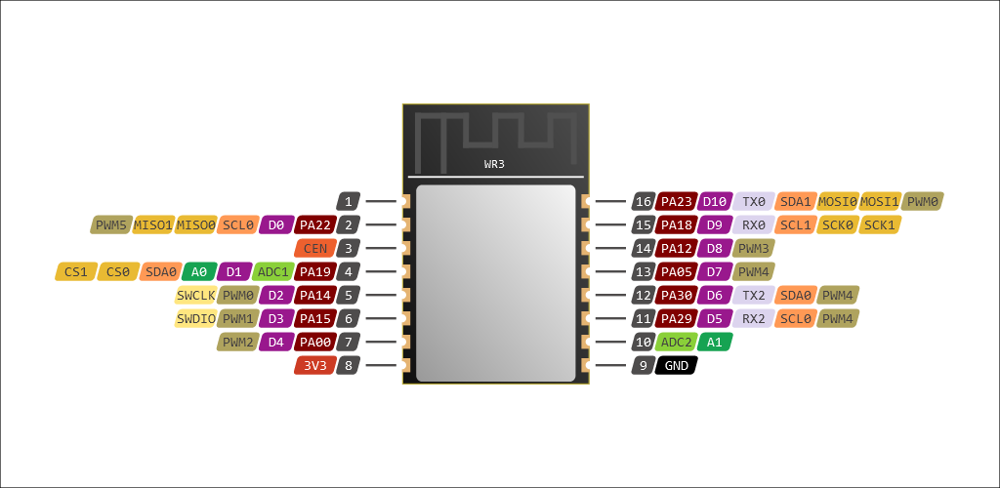

# boardgen

Automagically generate beautiful Adafruit-like pinout diagrams for IoT boards ✨

## Introduction

Boardgen allows to generate vector images, containing pinout diagrams for any IoT module. The images are inspired by Adafruit's great, well-recognized pinouts, and look like this one:



It is a Python tool that uses simple JSON files for defining shapes, colors, pin layouts and numbers. These files are then processed and drawn onto a .SVG image.

Defining new boards is fully done in JSON and doesn't require Python programming, nor SVG knowledge.

## Usage

Boardgen can be used as a library (see [cli.py](boardgen/cli.py) for an example) or with its built-in CLI program.

1. `pip install boardgen`
2. `boardgen --help`
3. `boardgen list boards` to get a list of available boards
4. `boardgen draw <board name>` to produce an image file in your working directory

```
Usage: boardgen [OPTIONS] COMMAND [ARGS]...

  boardgen CLI v0.1.0

Options:
  --boards TEXT     Custom boards directories
  --shapes TEXT     Custom shapes directories
  --templates TEXT  Custom templates directories
  --presets TEXT    Custom presets .json
  --roles TEXT      Custom roles .json
  --flash TEXT      Custom flash regions .json
  --help            Show this message and exit.

Commands:
  draw  Draw board diagrams
  list  List boards/templates/etc
```

### Board definitions

Writing board definitions means putting a .JSON file to a directory and specifying this directory using the `--boards` option.

Boardgen is meant to be used with PlatformIO-style board definition files. An example of such a board can be found [here (libretiny/boards/wr3.json)](https://github.com/kuba2k2/libretiny/blob/master/boards/wr3.json).

Note that the board manifest uses `"_base"` definitions. These are merged recursively with the manifest, and this result is expected to produce a complete file.

Apart from PlatformIO default variables (such as `build`, `debug`, `upload` or `name`, `url` and `vendor`) the board definition contains a [`Pcb`](boardgen/models/pcb.py) object.

### Templates

A [`Template`](boardgen/models/template.py) is a JSON object containing lists of shapes for each side of a PCB. Additionally, it contains a mapping of pin names to shape IDs to allow automatic alignment of pinout labels.

```json
{
	"name": "demo-template",
	"title": "Demo template",
	"width": 10,
	"height": 20,
	"front": [
		{"info": "List of front side shapes goes here"},
		{
			"comment": "this is a sample rectangle",
			"id": "shape1",
			"type": "rect",
			"pos": "0,0",
			"size": "10,20",
			"fill": {"color": "black"}
		}
	],
	"back": [],
	"pads": {
		"1": "demo-template.front.shape1",
		"2": "demo-template.front.shape2",
		"3": "demo-template.front.shape3",
		"4": "demo-template.front.shape4",
	}
}
```

### Shapes

A shape JSON file is an array of multiple shape objects. Including shape JSON files is possible. For example, to include `my-shape.json`:

```json
{
	"name": "my-shape",
	"id": "id-of-my-shape",
	"pos": "5,10"
}
```

Each shape is a JSON object, which has a common set of attributes:
- `pos` - REQUIRED: defines the anchor of a shape (in milimeters)
- `preset` (or a `presets` array) - used to merge the shape object with a [preset object](boardgen/res/presets.json) (see "boardgen list presets")
- `id` - used to refer to the shape's anchor from the `pads` mapping
- `vars` - mapping of variables for `${VAR}` substitution, optional

#### Rectangles

- `type`: must be `"rect"`
- `pos`: REQUIRED: rectangle top-left corner position
- `size`: REQUIRED: rectangle size ("width,height") in milimeters
- `fill`: see FillStyle below
- `stroke`: see FillStyle below
- `rx`: X corner radius
- `ry`: Y corner radius

#### Circles

- `type`: must be `"circle"`
- `pos`: REQUIRED: circle center position
- `d`: diameter (milimeters), OR:
- `r`: radius (milimeters) - one of `d` and `r` is required
- `fill`: see FillStyle below
- `stroke`: see FillStyle below

#### Text

- `type`: must be `"text"`
- `pos`: REQUIRED: text center position
- `font_size`: REQUIRED: font size
- `text`: REQUIRED: string to draw
- `fill`: see FillStyle below

#### FillStyle

- `color`: string (color name, HTML hex), fill/stroke color
- `lgrad`: linear gradient as a list ["x,y", "color", "x,y", "color"]
  - 1st stop position
  - 1st stop color
  - 2nd stop position
  - 2nd stop color
- `width`: stroke width (not used for "fill")

## Support

As this project is just a quick solution that'll be used in [LibreTiny](https://github.com/kuba2k2/libretiny) for generating pinouts, it's not really well documented. If you find this project interesting and need any help using it, feel free to open an issue and I'll try to provide more examples and info on how to use it.
